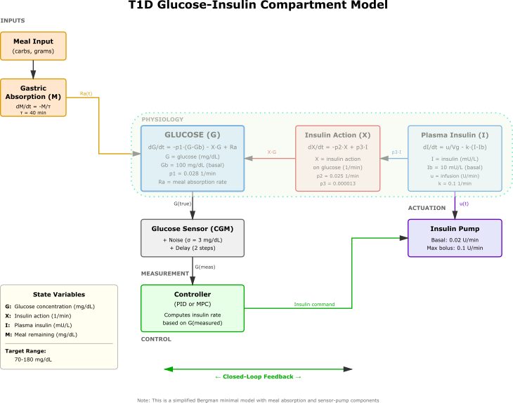

# T1D Blood Glucose Simulator with Closed-Loop Controllers

This repo provides a basic simulator framework for Type 1 Diabetes glucose regulation with closed-loop insulin delivery systems. Includes both **PID** and **Model Predictive Control (MPC)** algorithms. Designed for controller parameter optimization to improve time in range (TIR).

## Version

- **Code version**: `v0.3.0`
- **Current commit**: `4ddab6b`
- **Previous release commit**: `1931537`

## Differences From Last Release (commit `1931537`)

- Added `PatientProfile` support in `glucose_simulator.py` for explicit patient-specific physiological configuration.
- Moved `insulin_clearance_rate` into `PhysiologicalParams` so insulin clearance can be patient-specific.
- Preserved backward compatibility for existing simulator construction patterns using `PhysiologicalParams()` directly.
- Added multiple virtual example patients in `parameter_optimization_example.py` and cohort-level controller evaluation.
- Added synthetic cohort generation with reproducible sampling distributions and CSV export:
    - `synthetic_patient_cohort.csv`
    - `multi_patient_results.csv`
    - `multi_patient_summary.csv`
- Added CLI arguments to `parameter_optimization_example.py`:
    - `--cohort-size`
    - `--cohort-seed`
    - `--cohort-only`
- Improved portability by replacing hard-coded absolute output paths with script-local paths.
- Improved script execution reliability in wrapped environments by ensuring sibling-module imports resolve correctly.

## Release Tag Format

Use this checklist for each new release entry:

1. Update `Code version` (semantic versioning suggested: `vMAJOR.MINOR.PATCH`).
2. Update `Current commit` and `Previous release commit` hashes.
3. Add a short bullet list under `Differences From Last Release` with:
    - API/interface changes
    - New features
    - Compatibility notes
    - Output/artifact changes
4. Add or update any command examples affected by the release.

Suggested release note block:

```markdown
## Version

- **Code version**: `vX.Y.Z`
- **Current commit**: `<short_hash>`
- **Previous release commit**: `<short_hash>`

## Differences From Last Release (commit `<short_hash>`)

- Change 1
- Change 2
- Change 3
```

## Overview

This simulator consists of four main components:

1. **Physiological Model**: Simplified compartment model based on the Bergman minimal model for glucose-insulin dynamics. This is Yes, the Bergman Minimal Model can explain and model the behavior of glucose-insulin regulation in Type 1 Diabetes (T1D), although its simplicity requires modifications to account for the lack of endogenous insulin production. It remains in use to study T1D because it provides a good balance between model complexity and simulation accuracy. 
2. **Glucose Sensor**: Continuous glucose monitor (CGM) with configurable noise and delay
3. **Insulin Pump**: Insulin delivery device with rate constraints
4. **Controller** This can be either based on a 5-parmeter PID, or a 7-parameter MPC.

Two controller types are available:
- **PID Controller**: Fast, reactive control with 5 tunable parameters
- **MPC Controller**: Advanced predictive control with horizon-based optimization



## Repo Structure

```
T1DSim/
├── glucose_simulator.py              # Main simulator with PID controller
├── mpc_controller.py                 # Model Predictive Control implementation
├── parameter_optimization_example.py # PID parameter optimization examples
├── controller_tuning_guide.md        # PID parameter tuning guide
├── mpc_tuning_guide.md              # MPC parameter tuning guide
├── README.md                          # This file
├── simulation_results.png            # PID simulation plots (generated)
└── mpc_comparison.png                # PID vs MPC comparison (generated)
```

## Some Organisational Things...

- **Modularity**: Each component (physiology, sensor, pump, controller) is independent and configurable
- **Two Controller Types**: PID (reactive) and MPC (predictive) algorithms; I suggest you start only with PID
- **Separated Controller Parameters**: Controller parameters are isolated in dedicated classes for easy optimization
- **Time in Range Metrics**: Built-in calculation of TIR and related metrics (time below/above range, CV, etc.)
- **Ready for Optimization**: Framework supports grid search or other optimization methods
- **Multiple Meal Scenarios**: This can be used to test controller robustness across different meal patterns
- **MPC Meal Announcement**: MPC can use announced meals for feedforward control

## Controller Types

### PID Controller (glucose_simulator.py)

Traditional PID control with 5 parameters to optimize:

- `Kp`: Proportional gain - response to current glucose error
- `Ki`: Integral gain - response to accumulated error over time
- `Kd`: Derivative gain - response to rate of glucose change
- `target_glucose`: Target glucose level (mg/dL)
- `deadband`: Tolerance band around target where no correction is applied

**Advantages**: Fast, simple, easy to tune, proven reliability

### MPC Controller (mpc_controller.py)

Advanced Model Predictive Control with 7+ parameters to optimize
and a target to be set:

- `prediction_horizon`: How far ahead to predict (time steps)
- `control_horizon`: How many control moves to optimize
- `weight_tracking`: Importance of tracking target glucose
- `weight_control`: Penalty for insulin usage
- `weight_rate`: Penalty for rate of insulin change
- `weight_terminal`: Importance of final predicted state
- `weight_violation`: Penalty for constraint violations
- `target_glucose`: Target glucose level (mg/dL)

**Advantages**: Predictive, handles constraints explicitly, meal announcements, typically considered to be 5-10% better TIR in real-world use

## Quick Start

### 1. Run PID Controller Demonstration

```python
python glucose_simulator.py
```

This runs a 12-hour simulation with PID control, three meals, and displays:
- Time in range metrics
- Glucose and insulin delivery plots
- Saved plot: `simulation_results.png`

### 2. Run MPC Controller Demonstration

```python
python mpc_controller.py
```

This runs both PID and MPC simulations, comparing their performance:
- Side-by-side comparison of glucose trajectories
- Performance metrics comparison
- Insulin delivery patterns
- Saved plot: `mpc_comparison.png`

### 3. Run Parameter Optimization Example

```python
python parameter_optimization_example.py
```

This demonstrates:
- How to evaluate controller parameters
- Structure for grid search optimization
- Testing across multiple meal scenarios
- Multi-patient evaluation across virtual patient profiles
- Synthetic patient cohort sampling with reproducible random seed
- Results saved to `optimization_example_results.csv`

Run synthetic cohort generation only:

```python
python parameter_optimization_example.py --cohort-only --cohort-size 30 --cohort-seed 123
```

### Full Search
Here is an example of how one would do a full search for TIR across many patients, many meal scenarios (behaviour) and many controller settings for ONE controller type:

1. Generate 30 patients ONCE (seed=42)

2. Define 4 meal scenarios ONCE (standard, high_carb, low_carb, irregular)

3. Grid search with proper nesting:
   └─ For each controller config (192 configurations)
      └─ For each patient (30 patients)
         └─ For each meal scenario (4 scenarios)
            └─ Run simulation → record TIR

### 4. Custom Usage - PID Controller

```python
from glucose_simulator import (
    PhysiologicalParams, SensorParams, PumpParams, ControllerParams,
    T1DSimulator, calculate_time_in_range
)

# Define controller parameters to test
controller_params = ControllerParams(
    Kp=0.0005,
    Ki=0.00001,
    Kd=0.0001,
    target_glucose=110.0,
    deadband=15.0
)

# Create simulator with standard physiology and devices
simulator = T1DSimulator(
    PhysiologicalParams(),
    SensorParams(),
    PumpParams(),
    controller_params
)

# Run simulation with meals
meals = [(60, 50), (240, 60), (480, 55)]  # (time_min, carbs_g)
results = simulator.simulate(duration=720, dt=1.0, meals=meals)

# Calculate metrics
metrics = calculate_time_in_range(results['true_glucose'])
print(f"Time in Range: {metrics['time_in_range_pct']:.1f}%")
```

### 5. Custom Usage - MPC Controller

```python
from mpc_controller import MPCParams, MPCSimulator
from glucose_simulator import PhysiologicalParams, SensorParams, PumpParams

# Define MPC parameters
mpc_params = MPCParams(
    prediction_horizon=30,
    control_horizon=10,
    target_glucose=110.0,
    weight_tracking=1.5,
    weight_control=0.015,
    weight_rate=0.05,
    weight_terminal=2.0,
    weight_violation=150.0
)

# Create MPC simulator
mpc_sim = MPCSimulator(
    PhysiologicalParams(),
    SensorParams(),
    PumpParams(),
    mpc_params
)

# Run simulation with meal announcement
meals = [(60, 50), (240, 60), (480, 55)]
results = mpc_sim.simulate(
    duration=720, 
    dt=1.0, 
    meals=meals,
    meal_announcement_time=15.0  # Announce 15 min before
)

# Calculate metrics
metrics = calculate_time_in_range(results['true_glucose'])
print(f"Time in Range: {metrics['time_in_range_pct']:.1f}%")

# Calculate metrics
metrics = calculate_time_in_range(results['true_glucose'])
print(f"Time in Range: {metrics['time_in_range_pct']:.1f}%")
```

## Optimization Workflow

### For PID Controller

1. **Define Parameter Ranges**: Set ranges for Kp, Ki, Kd, target_glucose, deadband
2. **Create Parameter Grid**: Use `numpy.linspace()` or other methods
3. **Evaluate Each Configuration**: Call `evaluate_controller_params()` for each combination
4. **Collect Metrics**: Store time in range and other metrics
5. **Select Best Parameters**: Find configuration with highest TIR
6. **Validate**: Test best parameters across multiple meal scenarios

See [controller_tuning_guide.md](controller_tuning_guide.md) for detailed PID tuning instructions.

### For MPC Controller

1. **Set Horizons**: Choose prediction and control horizons
2. **Define Weight Ranges**: Set ranges for tracking, control, rate, terminal, violation weights
3. **Grid Search**: Evaluate combinations of weights
4. **Constraint Tuning**: Ensure safety constraints are met
5. **Multi-Scenario Testing**: Validate across different meal patterns
6. **Select Optimal**: Choose parameters balancing TIR and safety

See [mpc_tuning_guide.md](mpc_tuning_guide.md) for detailed MPC tuning instructions.

### Example Grid Search (PID)

```python
import numpy as np
from parameter_optimization_example import evaluate_controller_params
from glucose_simulator import ControllerParams

results = []

for Kp in np.linspace(0.0001, 0.001, 10):
    for Ki in np.linspace(0.000005, 0.00002, 10):
        for Kd in np.linspace(0.00005, 0.0002, 10):
            controller_params = ControllerParams(Kp=Kp, Ki=Ki, Kd=Kd)
            metrics = evaluate_controller_params(controller_params)
            results.append(metrics)

# Find best configuration
best = max(results, key=lambda x: x['time_in_range_pct'])
```

## Metrics

The simulator calculates the following metrics:

- **Time in Range (TIR)**: Percentage of time glucose is 70-180 mg/dL
- **Time Below Range**: Percentage below 70 mg/dL (hypoglycemia)
- **Time Above Range**: Percentage above 180 mg/dL (hyperglycemia)
- **Mean Glucose**: Average glucose level
- **Coefficient of Variation (CV)**: Glucose variability measure
- **Min/Max Glucose**: Extreme glucose values

Target metrics for good control:
- TIR > 70%
- Time below range < 4%
- CV < 36%

## Synthetic Patient Cohort Generation

The simulator includes a sophisticated system for generating diverse virtual patient cohorts with realistic physiological variability.

### Methodology

#### 1. Phenotype Archetypes

Three physiological phenotypes serve as distribution centers:

- **insulin_sensitive_fast_absorption**: Lower basal insulin (Ib=9.0), higher insulin sensitivity (p3=0.000017), faster meal absorption (tau_meal=30 min)
- **reference_adult**: Average parameters (Ib=10.0, p3=0.000013, tau_meal=40 min)
- **insulin_resistant_slow_absorption**: Higher basal insulin (Ib=13.0), lower insulin sensitivity (p3=0.000009), slower absorption (tau_meal=55 min)

Phenotypes are sampled with probabilities: 25% sensitive, 50% reference, 25% resistant.

#### 2. Parameter Variability

Each patient is generated by:

1. **Selecting a phenotype** (randomly based on probabilities)
2. **Sampling latent factors**:
   - `z_resistance` ~ N(0,1): Affects insulin resistance (higher → more resistant)
   - `z_kinetics` ~ N(0,1): Affects metabolic kinetics (higher → faster)
3. **Sampling each parameter** from distributions centered on the phenotype archetype:

| Parameter | Distribution | Description |
|-----------|--------------|-------------|
| **Gb** (basal glucose) | Truncated Normal | σ=8.0, bounds [75, 140] mg/dL |
| **Ib** (basal insulin) | Bounded Log-Normal | median × exp(0.20·z_r), σ_log=0.25, bounds [4, 25] mU/L |
| **p1** (glucose effectiveness) | Bounded Log-Normal | median × exp(0.10·z_k), σ_log=0.20, bounds [0.015, 0.045] 1/min |
| **p2** (insulin action rate) | Bounded Log-Normal | median × exp(0.10·z_k), σ_log=0.20, bounds [0.012, 0.040] 1/min |
| **p3** (insulin sensitivity) | Bounded Log-Normal | median × exp(-0.25·z_r), σ_log=0.35, bounds [4×10⁻⁶, 3×10⁻⁵] 1/(min·mU/L) |
| **tau_meal** (absorption) | Bounded Log-Normal | median × exp(-0.12·z_k), σ_log=0.25, bounds [20, 90] min |
| **Vg** (volume) | Truncated Normal | mean + 0.04·z_r, σ=0.15, bounds [1.1, 2.2] dL/kg |
| **body_weight** | Truncated Normal | 70 + 5·z_r, σ=12, bounds [45, 120] kg |
| **meal_bioavailability** | Truncated Normal | 0.525, σ=0.05, bounds [0.40, 0.70] |
| **insulin_clearance** | Bounded Log-Normal | Function of Vg, σ_log=0.20, bounds [0.05, 0.18] 1/min |

#### 3. Physiologically Realistic Correlations

The latent factors create clinically plausible dependencies:

- **Higher insulin resistance** (z_resistance > 0):
  - Higher basal insulin (Ib ↑)
  - Lower insulin sensitivity (p3 ↓)
  - Higher body weight (weight ↑)
  - Larger volume of distribution (Vg ↑)

- **Faster kinetics** (z_kinetics > 0):
  - Faster glucose effectiveness (p1 ↑)
  - Faster insulin action (p2 ↑)
  - Faster meal absorption (tau_meal ↓)

This ensures that patients aren't just randomly varied, but exhibit realistic co-variation of related physiological parameters.

### Usage

Generate a cohort of 30 patients:

```python
python parameter_optimization_example.py --cohort-only --cohort-size 30 --cohort-seed 123
```

Or programmatically:

```python
from parameter_optimization_example import create_synthetic_patient_cohort

profiles, cohort_df = create_synthetic_patient_cohort(
    n_patients=30,
    random_seed=123,
    phenotype_probs=(0.25, 0.50, 0.25)  # sensitive, reference, resistant
)

# Save to CSV
cohort_df.to_csv('my_cohort.csv', index=False)
```

### Output

The generated cohort is saved to `synthetic_patient_cohort.csv` with columns:
- `patient_id`: Unique identifier (includes phenotype)
- `phenotype`: Archetype category
- `Gb`, `Ib`, `p1`, `p2`, `p3`, `tau_meal`, `Vg`, `insulin_clearance_rate`: Physiological parameters
- `body_weight`: Patient weight (kg)
- `meal_bioavailability`: Carbohydrate absorption fraction

### Fixed Example Patients vs. Synthetic Cohort

**Fixed example patients** (`create_example_patients()`):
- 3 hardcoded prototypical patients
- Exact parameter values per archetype
- Used for rapid controller testing

**Synthetic cohort** (`sample_virtual_patient()`):
- Diverse population with realistic variability
- Each patient is unique, even within same phenotype
- Used for robust controller evaluation across populations
- Essential for testing generalization and safety

## Component Details

### Physiological Model

Based on Bergman minimal model with three states:
- **G**: Glucose concentration (mg/dL)
- **X**: Insulin action on glucose disappearance
- **I**: Plasma insulin concentration

Includes first-order meal absorption kinetics.

### Glucose Sensor

Simulates CGM characteristics:
- Gaussian measurement noise (configurable std dev)
- Measurement delay (buffer-based)
- Calibration error (multiplicative factor)

### Insulin Pump

Models pump constraints:
- Basal rate (continuous background insulin)
- Maximum bolus rate (correction limit)
- Minimum delivery rate (usually 0)

### Controllers

**PID Controller**:
- **P term**: Proportional to glucose error
- **I term**: Accumulated error (with anti-windup)
- **D term**: Rate of change of glucose
- **Deadband**: No action within acceptable range

**MPC Controller**:
- **Prediction Model**: Internal model for glucose prediction
- **Optimization**: Solves constrained optimization problem each time step
- **Cost Function**: Balances tracking, control effort, smoothness, constraints
- **Receding Horizon**: Applies only first control move, re-optimizes next step

## Dependencies

```
numpy
matplotlib
pandas  # For optimization examples
scipy   # For MPC optimization
```

Install with:
```bash
pip install numpy matplotlib pandas scipy
```

## Customization

### Change Physiological Parameters

```python
phys_params = PhysiologicalParams(
    Gb=100.0,      # Basal glucose
    p1=0.028,      # Glucose effectiveness
    p2=0.025,      # Insulin action rate
    p3=0.000013,   # Insulin sensitivity
)
```

### Modify Sensor Characteristics

```python
sensor_params = SensorParams(
    noise_std=5.0,         # Higher noise
    delay=3,               # More delay
    calibration_error=1.05 # 5% calibration error
)
```

### Adjust Pump Settings

```python
pump_params = PumpParams(
    basal_rate=0.025,      # Higher basal rate
    max_bolus_rate=0.15,   # Higher max bolus
)
```

## Advanced Usage

### Test Multiple Meal Scenarios

```python
scenarios = {
    'Standard': [(60, 50), (240, 60), (480, 55)],
    'High Carb': [(60, 80), (240, 90), (480, 85)],
    'Irregular': [(45, 40), (180, 30), (360, 70)],
}

for name, meals in scenarios.items():
    results = simulator.simulate(duration=720, dt=1.0, meals=meals)
    metrics = calculate_time_in_range(results['true_glucose'])
    print(f"{name}: TIR = {metrics['time_in_range_pct']:.1f}%")
```

### Use Alternative Optimization Methods

```python
from scipy.optimize import differential_evolution

def objective(params):
    """Negative TIR for minimization."""
    controller_params = ControllerParams(
        Kp=params[0], Ki=params[1], Kd=params[2]
    )
    metrics = evaluate_controller_params(controller_params)
    return -metrics['time_in_range_pct']

bounds = [(0.0001, 0.001), (0.000005, 0.00002), (0.00005, 0.0002)]
result = differential_evolution(objective, bounds)
print(f"Optimal parameters: Kp={result.x[0]:.6f}, Ki={result.x[1]:.6f}, Kd={result.x[2]:.6f}")
```

## Visualization and Analysis

The optimization scripts save complete time-series data for every simulation, enabling detailed post-analysis and visualization.

### Output Directory Structure

After running `parameter_optimization_example.py`, the following structure is created:

```
simulation_time_series/
├── synthetic_001_insulin_sensitive_fast_absorption/
│   ├── config_001_standard.json
│   ├── config_001_high_carb.json
│   ├── config_001_low_carb.json
│   ├── config_001_irregular.json
│   ├── config_002_standard.json
│   └── ...
├── synthetic_002_reference_adult/
│   └── ...
└── [one subdirectory per patient]

plots/
├── synthetic_001_..._config_001_scenarios.png
├── patient_comparison_config_001_standard.png
└── ...
```

Each JSON file contains:
- Complete glucose, insulin, and time arrays
- Controller parameters (Kp, Ki, Kd, target, deadband)
- Patient physiological parameters
- Meal scenario details
- Performance metrics (TIR, mean glucose, CV, etc.)
- Metadata (timestamps, simulation settings)

### Plot One Patient Across All Meal Scenarios

To visualize how a single patient responds to different meal scenarios:

```bash
# Quick example (auto-selects first patient, config 1)
python plot_example.py

# Or specify a patient directory
python plot_patient_scenarios.py simulation_time_series/synthetic_001_insulin_sensitive_fast_absorption

# Specify configuration number
python plot_patient_scenarios.py simulation_time_series/synthetic_015_reference_adult --config 3
```

**Output**: 2×2 subplot grid showing glucose time-series for standard, low_carb, high_carb, and irregular meal scenarios. Each subplot displays:
- True glucose (blue solid line)
- Measured glucose with sensor noise (red dashed line)
- Insulin delivery rate (purple line, right y-axis)
- Target range (70-180 mg/dL, green shading)
- Controller target glucose (purple dashed line)
- Carb intakes (vertical green lines with gram annotations)
- Performance metrics (TIR%, mean glucose, CV)

### Compare Multiple Patients

To see how different patients respond to the same controller and scenario:

```bash
# Compare first 6 patients for standard meals, config 1
python plot_patient_comparison.py --scenario standard --config 1

# Show more patients
python plot_patient_comparison.py --scenario high_carb --config 2 --max-patients 10

# Different meal scenario
python plot_patient_comparison.py --scenario irregular --config 1
```

**Output**: Stacked plots showing each patient's glucose and insulin response, highlighting inter-patient variability in both glucose control and insulin requirements.

### Programmatic Plotting

```python
from plot_patient_scenarios import plot_patient_scenarios
from pathlib import Path

# Plot one patient
patient_dir = Path('simulation_time_series/synthetic_001_insulin_sensitive_fast_absorption')
plot_patient_scenarios(patient_dir, config_idx=1, save_fig=True)

# Compare patients
from plot_patient_comparison import plot_patient_comparison
plot_patient_comparison('simulation_time_series', config_idx=1, 
                       scenario='standard', max_patients=6)
```

### Custom Analysis

Load and analyze JSON data directly:

```python
import json
import numpy as np

# Load simulation data
with open('simulation_time_series/synthetic_001_.../config_001_standard.json', 'r') as f:
    data = json.load(f)

# Extract time series
time = np.array(data['time_series']['time_minutes'])
glucose = np.array(data['time_series']['true_glucose_mgdL'])
insulin = np.array(data['time_series']['insulin_rate_U_per_min'])

# Access parameters
patient_params = data['patient_parameters']
controller_params = data['controller_parameters']
metrics = data['metrics']

# Perform custom analysis
print(f"Patient Gb: {patient_params['Gb']:.1f} mg/dL")
print(f"TIR: {metrics['time_in_range_pct']:.1f}%")
print(f"Mean insulin: {np.mean(insulin):.4f} U/min")
```

## Limitations


- Simplified physiological model (not suitable for clinical use)
- No model of glucagon or other counter-regulatory hormones
- Simplified insulin pharmacokinetics
- No exercise, stress, or other metabolic disturbances
- Deterministic meal absorption (no variability)

## Future Enhancements

Potential improvements:
- More sophisticated physiological models (multi-compartment insulin distribution)
- Glucagon and counter-regulatory hormone models
- Exercise and stress effects on insulin sensitivity
- Inter-day and intra-day variability in absorption/sensitivity
- Stochastic meal absorption timing and bioavailability
- Patient-adaptive controller tuning algorithms
- Real-world sensor artifacts (compression, signal loss, warm-up)

## License

This code is being developed for educational an methodology research. It is expressly prohibited that 
this be used to provide patient-oriented recommendations or device adjustments.

## Citation

If you use this simulator in your research, please cite:
```
T1D Blood Glucose Simulator
URL: [Your repository URL]
Date: January 2026
```

## Contact

For questions or suggestions, please open an issue on the project repository.
